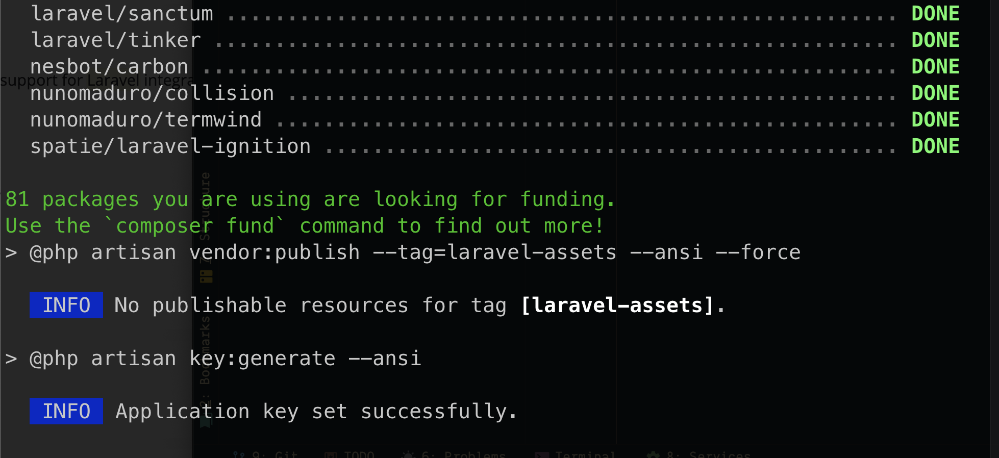

# Notas resumidas de instalación

> Usando una terminal vamos a ir a nuestro directorio contenedor
> Una vez ahi, vemos a usar composer para instalas un nmuevo proyecto

    composer create-project laravel/laravel agencia

> Una vez instalado nos tenemos que mover dentro de la carpeta "agencia"
> y ahi lanzar el proyecto

    php artisan serve 

